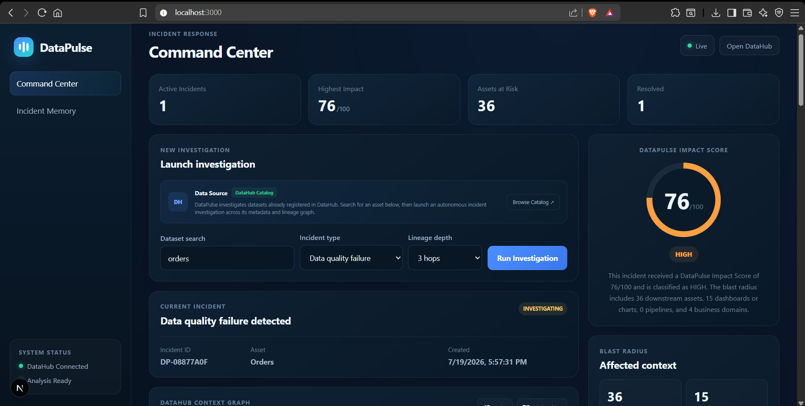
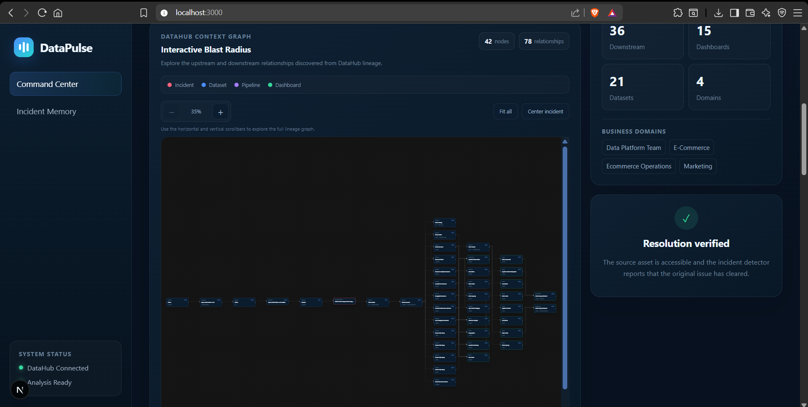
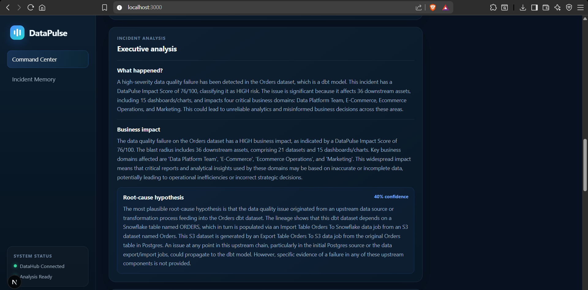
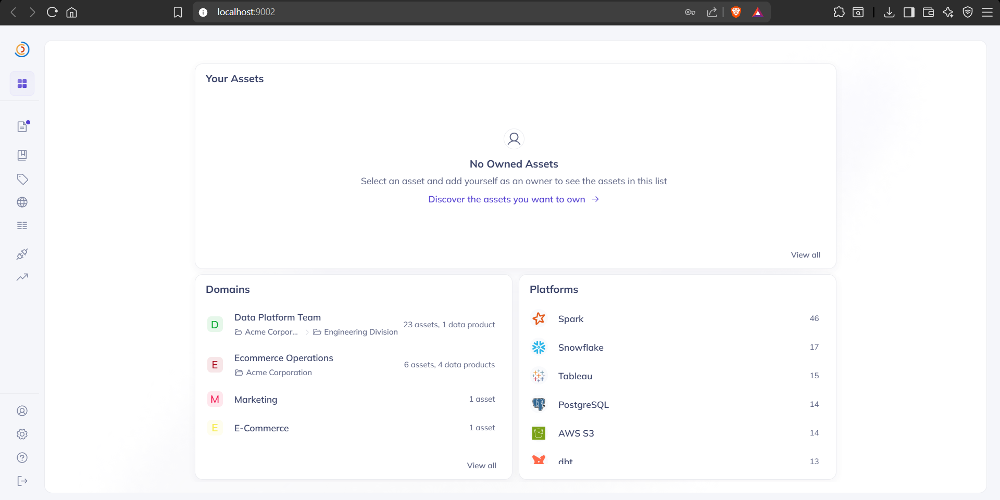
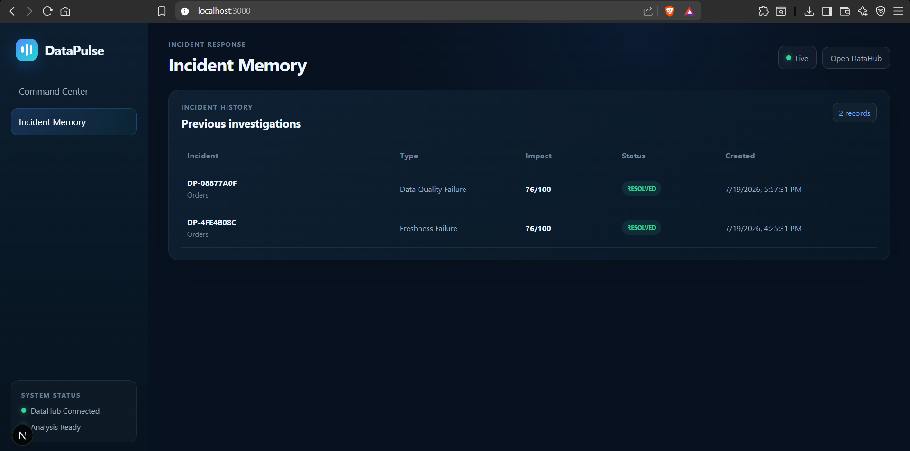
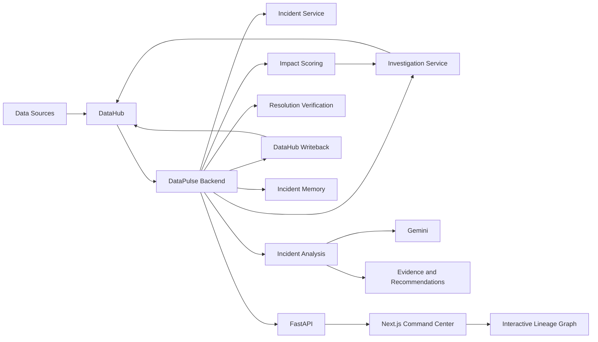

# DataPulse

DataPulse is a data incident intelligence and response platform built on top of DataHub.

Instead of only showing that data is connected, DataPulse investigates an incident, measures its blast radius, evaluates business impact, produces evidence-based recommendations, writes the result back to DataHub, verifies resolution, and preserves the incident for future reference.

---

## DataPulse Command Center



## Interactive Lineage Graph



## Incident Analysis



## DataHub Writeback



## Incident Memory



---

## Problem

Modern data platforms contain hundreds or thousands of connected datasets, pipelines, dashboards, and business assets.

When one important dataset fails, teams usually need to answer several questions manually:

- What is affected?
- Which downstream dashboards are at risk?
- Which business domains depend on this data?
- How serious is the incident?
- What should be investigated first?
- What evidence is confirmed?
- What is still only a hypothesis?
- Was the issue actually resolved?

DataHub provides the metadata and lineage needed to understand the data ecosystem.

DataPulse uses that context to turn a technical data incident into an actionable incident response workflow.

---

## What DataPulse Does

```text
Incident
   ↓
DataHub Metadata Investigation
   ↓
Upstream + Downstream Lineage
   ↓
Business Context
   ↓
Deterministic Impact Score
   ↓
Incident Analysis
   ↓
Evidence + Limitations
   ↓
Recommended Actions
   ↓
DataHub Writeback
   ↓
Resolution Verification
   ↓
Incident Memory
```

---

## Main Features

### DataHub-Powered Investigation

DataPulse searches the DataHub catalog and investigates connected assets using metadata and lineage context.

It analyzes:

- Upstream dependencies
- Downstream dependencies
- Datasets
- Dashboards
- Data pipelines
- Owners
- Business domains

---

### Interactive Blast Radius

The application visualizes the incident's DataHub lineage graph.

Users can:

- Explore upstream and downstream assets
- Zoom and scroll through large lineage graphs
- Center the incident source
- Fit the complete graph into view
- Click individual assets
- Inspect platform, ownership, domain, direction, and lineage distance

---

### Deterministic Impact Score

DataPulse calculates an impact score from `0–100`.

The score is based on:

- Incident severity
- Blast radius
- Business exposure
- Operational complexity
- Governance risk

The impact score is deterministic and is not generated by the language model.

---

### Grounded Incident Analysis

DataPulse combines structured DataHub context with Gemini to produce:

- Executive incident summary
- Business impact summary
- Root-cause hypothesis
- Root-cause confidence
- Evidence
- Limitations
- Prioritized recommended actions

The system explicitly separates confirmed evidence from unverified hypotheses.

---

### DataHub Writeback

After an investigation, DataPulse writes incident intelligence back to the source asset in DataHub.

Example properties include:

```text
datapulse_incident_id
datapulse_incident_type
datapulse_incident_status
datapulse_impact_score
datapulse_risk_level
datapulse_downstream_assets
datapulse_affected_dashboards
datapulse_affected_domains
datapulse_root_cause_confidence
datapulse_root_cause_hypothesis
datapulse_executive_summary
datapulse_last_analysis
```

This allows incident knowledge to become part of the metadata environment instead of disappearing after troubleshooting.

---

### Resolution Verification

DataPulse supports a resolution workflow that:

1. Receives a signal that the original issue has cleared.
2. Verifies that the affected source asset is still accessible.
3. Updates the incident state.
4. Writes the resolved state back to DataHub.
5. Preserves the complete incident record.

The current hackathon demo uses a simulated monitoring signal for the initial incident and resolution status.

---

### Incident Memory

Completed investigations are stored locally so previous incidents can be reopened and reviewed.

Incident Memory preserves:

- Incident details
- Investigation results
- Blast radius
- Impact score
- Incident analysis
- Recommended actions
- Resolution verification

Runtime incident history is intentionally excluded from Git.

---

## Architecture



---

## DataHub Integration

DataHub is a core part of the application rather than a simple external data source.

DataPulse uses DataHub for:

### Metadata Discovery

Searching datasets and identifying the incident source.

### Agent Context

Retrieving DataHub context for investigation.

### Lineage

Tracing upstream and downstream dependencies.

### Business Context

Using owners, domains, platforms, and asset metadata.

### Blast Radius

Measuring the scope of downstream impact.

### Writeback

Writing incident intelligence back into the DataHub metadata graph.

---

## Technology Stack

### Backend

- Python
- FastAPI
- DataHub Python SDK
- DataHub Agent Context
- Google Gemini
- Pydantic

### Frontend

- Next.js
- React
- React Flow

### Infrastructure

- Docker
- DataHub
- GitHub

---

## Project Structure

```text
datapulse-ai/
│
├── backend/
│   ├── app/
│   │   ├── agents/
│   │   ├── api/
│   │   ├── models/
│   │   ├── services/
│   │   └── main.py
│   │
│   ├── data/
│   ├── tests/
│   ├── requirements.txt
│   └── requirements-lock.txt
│
├── frontend/
│   ├── app/
│   │   ├── components/
│   │   ├── utils/
│   │   ├── globals.css
│   │   ├── layout.js
│   │   └── page.js
│   │
│   ├── package.json
│   └── package-lock.json
│
├── data_uploads/
├── docs/
├── examples/
├── scripts/
│
├── .env.example
├── .gitignore
├── LICENSE
└── README.md
```

---

# Local Setup

## Prerequisites

Before running DataPulse, install:

- Git
- Python 3.11
- Node.js and npm
- Docker Desktop
- DataHub

DataPulse expects the local services to use:

```text
DataPulse Frontend    http://localhost:3000
DataPulse Backend     http://localhost:8000
DataHub GMS           http://localhost:8080
DataHub UI            http://localhost:9002
```

---

## 1. Clone the Repository

```bash
git clone https://github.com/dharmiknakrani26/datapulse-ai.git
cd datapulse-ai
```

---

## 2. Configure Environment Variables

Copy:

```text
.env.example
```

to:

```text
.env
```

Example:

```env
DATAHUB_GMS_URL=http://localhost:8080
DATAHUB_GMS_TOKEN=

LLM_PROVIDER=gemini
LLM_API_KEY=
LLM_MODEL=gemini-2.5-flash
```

Add your Gemini API key.

Add a DataHub token when authentication is enabled in your DataHub environment.

Never commit `.env`.

---

## 3. Start DataHub

Start your local DataHub environment and confirm:

```text
http://localhost:9002
```

is available.

DataPulse requires datasets registered in DataHub.

For the strongest investigation experience, the dataset should have connected upstream or downstream lineage.

---

## 4. Install Backend Dependencies

Create a virtual environment:

```bash
python -m venv .venv
```

### Windows PowerShell

```powershell
.\.venv\Scripts\Activate.ps1
```

Install dependencies:

```bash
python -m pip install --upgrade pip
python -m pip install -r backend/requirements-lock.txt
```

Check dependencies:

```bash
python -m pip check
```

---

## 5. Start the Backend

```bash
python -m uvicorn backend.app.main:app --reload --port 8000
```

API documentation:

```text
http://localhost:8000/docs
```

Health endpoint:

```text
http://localhost:8000/api/health
```

---

## 6. Install Frontend Dependencies

Open another terminal:

```bash
cd frontend
npm ci
```

---

## 7. Start the Frontend

```bash
npm run dev
```

Open:

```text
http://localhost:3000
```

---

# Using DataPulse

## Step 1 — Select a Dataset

Enter a search term such as:

```text
orders
```

DataPulse searches the DataHub catalog for matching connected datasets.

---

## Step 2 — Select an Incident Type

Available demo incident types:

```text
Freshness Failure
Data Quality Failure
Schema Change
```

---

## Step 3 — Select Lineage Depth

Choose between:

```text
1–5 hops
```

A larger depth investigates more connected assets.

---

## Step 4 — Run Investigation

Click:

```text
Run Investigation
```

DataPulse will:

1. Find a matching DataHub dataset.
2. Create the selected incident.
3. Trace DataHub lineage.
4. Build the blast radius.
5. Collect business context.
6. Calculate the impact score.
7. Generate grounded incident analysis.
8. Generate prioritized response actions.
9. Write the result back to DataHub.
10. Save the incident to Incident Memory.

---

## Step 5 — Explore the Blast Radius

Use the interactive graph to inspect connected assets.

The graph supports:

- Horizontal scrolling
- Vertical scrolling
- Zoom controls
- Fit All
- Center Incident
- Asset selection

---

## Step 6 — Review Incident Analysis

Review:

```text
What happened?
Business impact
Root-cause hypothesis
Confidence
```

Then review:

```text
Confirmed Evidence
Analysis Limitations
Recommended Actions
```

---

## Step 7 — Verify Resolution

After the demo incident condition is considered cleared, click:

```text
Verify Resolution
```

The incident will move to:

```text
RESOLVED
```

when verification succeeds.

---

## Step 8 — Review Incident Memory

Open:

```text
Incident Memory
```

to review previous investigations.

---

# Using Your Own Data

DataPulse does not currently operate as a generic CSV analysis application.

The intended workflow is:

```text
Your Data Source
      ↓
DataHub Ingestion
      ↓
DataHub Metadata and Lineage
      ↓
DataPulse Investigation
```

Data can come from sources such as:

- Databases
- Data warehouses
- Data pipelines
- BI platforms
- File-based datasets

A standalone file without lineage can be registered in DataHub, but DataPulse provides the most value when the asset participates in a connected data ecosystem.

---

# API Endpoints

Important endpoints include:

```text
GET  /api/health

GET  /api/system/status

GET  /api/assets/search

POST /api/incidents/analyze

GET  /api/incidents

GET  /api/incidents/{incident_id}

GET  /api/incidents/{incident_id}/lineage-graph

POST /api/incidents/{incident_id}/resolve
```

Interactive documentation is available at:

```text
http://localhost:8000/docs
```

---

# Demo Workflow

A recommended demonstration:

```text
1. Open DataPulse Command Center
2. Show DataHub connection status
3. Search for "orders"
4. Select an incident type
5. Run Investigation
6. Show Impact Score
7. Explore the interactive lineage graph
8. Explain the business blast radius
9. Show incident analysis
10. Show Evidence and Limitations
11. Show recommended actions
12. Open DataHub and show writeback
13. Verify resolution
14. Open Incident Memory
```

---

# Current Demo Limitations

DataPulse is a hackathon prototype.

The current implementation has several intentional limitations.

### Incident Detection

Incident creation is simulated for the demonstration.

A production implementation would receive incidents from monitoring and observability systems.

### Resolution Signal

The current resolution workflow uses a simulated monitoring signal.

### Incident Storage

Incident Memory currently uses a local JSON file.

A production implementation should use a durable database.

### Deployment

The current development environment uses a local DataHub deployment.

Production deployment would require secure hosted infrastructure and production authentication.

These limitations are stated explicitly to avoid presenting demo functionality as production-ready automation.

---

# Future Improvements

Potential next steps include:

- Direct integration with observability platforms
- Automated DataHub assertion monitoring
- Slack and Microsoft Teams incident notifications
- Jira incident creation
- Persistent incident database
- Historical incident similarity search
- Automated owner notification
- Production-grade authentication
- Hosted DataHub integration

---

# License

This project is licensed under the Apache License 2.0.

See:

```text
LICENSE
```

for details.
